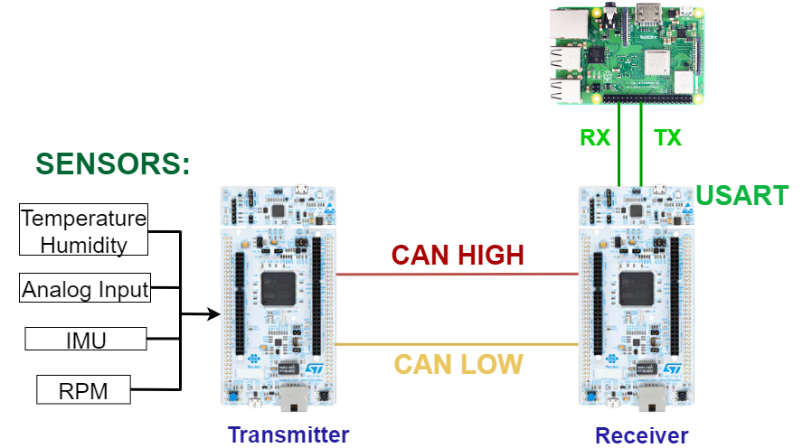

# 🖥️ Python GUI for Sensor Monitoring

## 📌 Key Points

- Developed a **Graphical User Interface (GUI)** in **Python**.  
- Displays real-time **sensor values** such as **speed, temperature, and RPM**.  
- Provides a clear and user-friendly interface for monitoring data.  
- Designed with scalability in mind for future integration of additional sensors.  
- Runs on **Raspberry Pi**, making it suitable for embedded and Formula Student applications.
